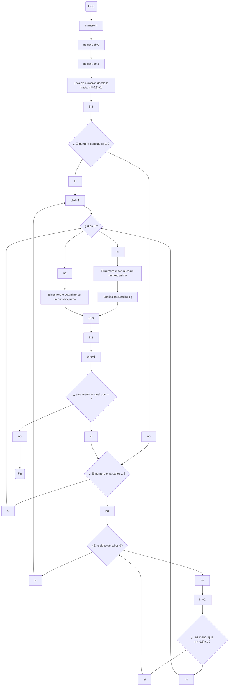

# Numeros-primos

###### Estaba pensando en ponerle de titulo al repositorio: Entre primo y primo mas me arrimo, pero no me dio el coraje

#### En este repositorio se comentara todo el desarrollo de la actividad necesaria para completar el reto 3

---
### Requisitos

[] Escribir en pseudocodigo un algoritmo que permita encontrar todos los numeros primos hasta un numero n

[] Hacer un diagrama de flujo que permita encontrar todos los numeros primos hasta un numero n

---

### Pseudocodigo: 

```
n:entero
i:entero
d:entero
Inicio
i:=2
d:=0
si n==1
//no hay primos que encontrar;
si n==2
//solo esta 2 como primo
Escribir ("2");
Para (m<-2;m<=n;m++){
Para (i<-2;i<√(n)+1;i++){
Si modulo (m,i) !=0
d:=d+1;
}
si d==0
//El actual n es primo
escribir ("n, ");+
d:=0
}
```

### Diagrama de flujo:


